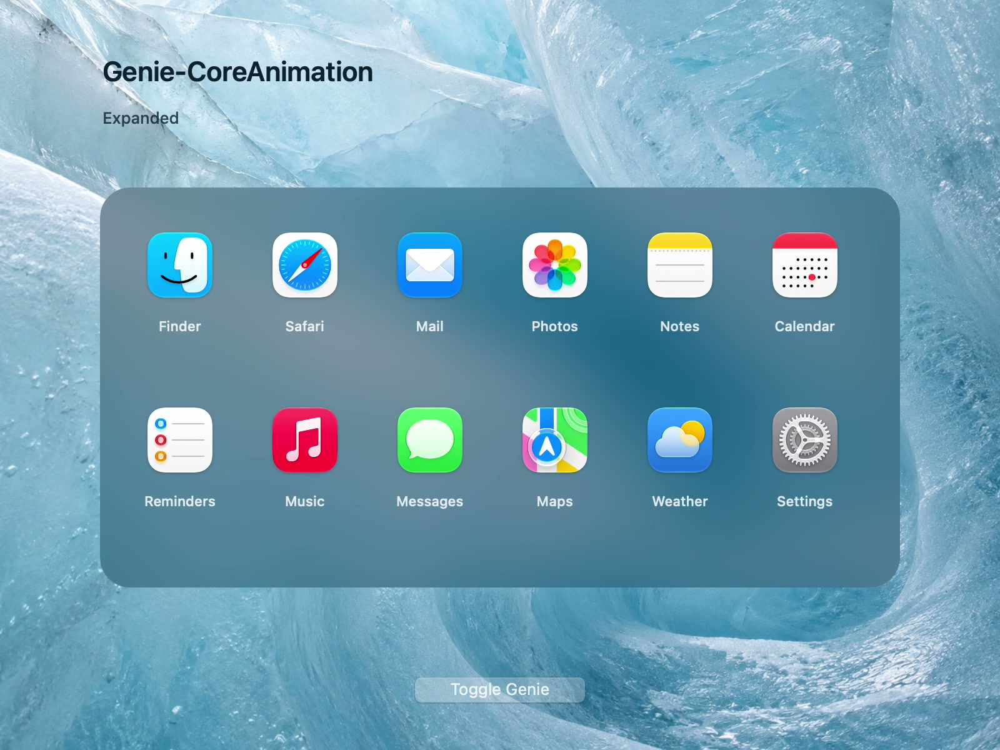

# Genie-CoreAnimation

Genie-style transitions for macOS layers, with opening, closing, and mid-animation reversal. Built on [usagimaru’s GenieWarpMesh](https://github.com/usagimaru/GenieWarpMesh).

[](docs/media/genie-ca-live-blur.mp4)

**[Watch the demo →](docs/media/genie-ca-live-blur.mp4)** · 60 fps video · Live AppKit blur · 0.5-second transitions

## Try it

macOS 14+ · Swift 5.9+

```sh
swift run -c release GenieCADemo
```

Click **Toggle Genie** to open, close, or reverse the animation. The demo uses an original glacier background and the installed macOS app icons.

```sh
swift test -c release
```

## Use in your app

Add the local package and library dependency:

```swift
.package(path: "../Genie-CoreAnimation")

.target(name: "YourApp", dependencies: ["GenieWarpMesh"])
```

`GenieLayerEffect` plays precomputed mesh keyframes through Core Animation. A synchronized mask keeps a sibling `NSVisualEffectView` backdrop live during motion. The original window-based `GenieEffect` is also available.

See the [integration guide](docs/USAGE.md), [AppKit demo](Examples/GenieCADemo/main.swift), and [recording notes](docs/VIDEO.md).

## Compatibility

Uses private APIs, including `CAMeshTransform`, with runtime availability checks. Future macOS compatibility and App Store acceptance are not guaranteed. Handle playback failure and Reduce Motion in your app.

## Credits

Thank you to [usagimaru](https://github.com/usagimaru) for the original [GenieWarpMesh](https://github.com/usagimaru/GenieWarpMesh) implementation and geometry. Its history, copyright notice, and [MIT license](LICENSE) are preserved. [Bartosz Ciechanowski’s mesh-transform article](https://ciechanow.ski/mesh-transforms/) informed the runtime bridge.

Original documentation: [English](UPSTREAM_README.md) · [Japanese](README_ja.md)
